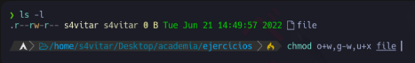

# Baimenak Linux
- [Baimenak Linux](#baimenak-linux)
  - [Fitxategi eta direktorioren baimenak](#fitxategi-eta-direktorioren-baimenak)
    - [baimen taldeak](#baimen-taldeak)
    - [Baimenak oktalea](#baimenak-oktalea)
  - [Stiky bit baimena](#stiky-bit-baimena)
  - [SUID eta SUID baimenak](#suid-eta-suid-baimenak)
    - [SUID](#suid)
  - [Ezaugarri bereziak - lsattr](#ezaugarri-bereziak---lsattr)
- [Ariketak](#ariketak)
  - [Ariketa 1](#ariketa-1)
  - [Ariketa 2](#ariketa-2)
  - [Ariketa 3](#ariketa-3)
  - [Ariketa 4](#ariketa-4)
  - [Ariketa 5](#ariketa-5)
  - [Ariketa 6](#ariketa-6)
  - [Ariketa 7](#ariketa-7)

## Fitxategi eta direktorioren baimenak

Fitxategi eta direktorioren baimenak hurrengo aginduarekin ikusi ditzakegu

```bash
ls -a
```


### baimen taldeak

- Jabea (user): Fitxategi bat sortzen dugunean,
sortzailea jabea izango da defektuz.
- Talde (group): Fitxategi baten jabetza talde bati ere bai dagokio.
- Besteak (other): Edo taldekideak ez direnal.


Linux sistemetan, "baimen mota" edo "modo deitzailea" eta `chmod` komandoaren erabilera oso garrantzitsua da. Hemen bi termino hauek azaltzen dizkizut:

1. **Baimen motak (Permission Types)**:
   Linux sistemak fitxategi edo direktorio bakoitzeko hiru baimen mota desberdin ditu:
   - **Read (Irakurketa)** (`r`): Fitxategia irakur daiteke.
   - **Write (Idazketa)** (`w`): Fitxategia editatu, idatzi edo eguneratu daiteke.
   - **Execute (Exekuzioa)** (`x`): Fitxategia exekutatu daiteke, adibidez, script-a edo programa bat.

   Baimen motak, fitxategien eta direktorien erabiltzaile, taldea eta beste erabiltzaileak baimendu dezaketen ekintzak zehazten dituzte. `ls -l` komandoa erabiliz, fitxategiak erakutsi daitezke baimen motak ikusi nahi dituzunean.

   Adibidez, `rw-r--r--` baimen mota katea honako esanahia du:
   - Fitxategiaren jabeak (`rw-`) irakurri eta idatzi dezake, baina ezin du exekutatu.
   - Beste erabiltzaile guztiak (`r--`) fitxategia soilik irakurri dezakete, ezin dute editatu edo exekutatu.

2. **`chmod` Aginduaren Motak**:
   `chmod` komandoa erabiltzen da baimen motak aldatzeko. Bi erara erabili daiteke:
   - **Testu erabilera (Symbolic Mode)**: `chmod`-en aginduak sinboloak erabiliz adierazten dira. Adibidez, `u+x` erabiltzean, erabiltzaileak exekutatzeko baimena gehituko dio.
     ```
     chmod u+x fitxategia.txt
     ```

   - **Zenbaki erabilera (Numeric Mode)**: Baimen motak zenbaki baten bitartez adierazten dira.
     - Read (`r`) = 4
     - Write (`w`) = 2
     - Execute (`x`) = 1

     Adibidez, `chmod 644 fitxategia.txt` erabiltzean, `fitxategia.txt`-ri irakurketa baimena ematen dio jabeari eta bestelako erabiltzaileei, eta idazteko baimena jabeari bakarrik.

Hauexek dira, oro har, baimen motak eta `chmod` komandoaren aginduen motak Linuxen. Beti gogoratu, sistemaren segurtasuna arintzeko baimenak behar bezala ezartzea gomendatzen da.

Adibidez, jabeari (user) exekutazio baimena horrela heman ahal ditugu.
```bash
chmod u+x ``` froga.txt
```
### Baimenak oktalea

- 0 = 000 = baimenarik gabe
- 1 = 001 = --x = exekuzio baimena
- 2 = 010 = -w- = idazteko baimena
- 3 = 011 = -wx = idazteko eta exekutazteko baimena
- 4 =100 =r--=irakurtzeko baimena
- 5 = 101 = r-x = irakurtzeko eta exekutatzeko baimena
- 6 = 110 = rw- = irakurtzeko eta idazteko baimena
- 7 = 110 = rwx = baimena guztiak

Baimen guztiak kentzeko
```bash
chmod 000 froga.txt
```
baimen guztiak gehitzeko 
 ```bash
 chmod 777 froga.txt
 ```
Erabiltzeleari baimen guztiak emateko eta besteei edo taldekideei irakurtze exekuzio baimenak emateko.
```bash
chmod 755 froga.txt
```

## Stiky bit baimena

stiky bita daukan fitxategi edo direktorioa  bakarrik jabeak edo roteak aldatu edo borratu dezakete izena
```bash
chmod +t froga.txt
```


## SUID eta SUID baimenak

### SUID
SUID aktibatuta dagoenean fitxategi 
hau exekutatzen da duen erabiltzaileak
sortzailearen baimenak izango ditu.

```bash
chmod u+s froga.txt
```

Sortu exekutable root bezala 
hurrengo edukiarekin eta izenarekin.


suidfroga.sh
```bash
#/bin/bash
wcho erabiltzailea
id
echo exekuzio baimen
echo $euid
```

Baimenak esleituko dizkiogu
fitxategiari
```bash
chmod 755 suidfroga.sh
```

Ezarri SUID suidfroga.sh
fitxategiari

```bash
chmod u+s suidfroga.sh
```


```bash
chmod 4755 suidfroga.sh
```

## Ezaugarri bereziak - lsattr
eta chattr

Ezaugarri bereziak ikusteko
`lsattr agindua erabiliko ditugu

Ezaugarri bereziak aldatzeko
`chattr agindua erabiliko dugu.

Adibidez i atributuarekin
fitxategi bat inmutablea
bilakatzen dugu, Hau esan nahi du
inork ezin duela aldatu ez ezabatu,ezta root-ek, ezabatu
nahi izakoetan, i atributoa
kendu baharko genioke lehenago.

```bash
chattr +i froga.txt
lsattr froga.txt
```

u ezaugarriarekin ezabatzen dugunean, 
datuak gordeta gelditzen dira
 eta bere berreskurapena ahalbidatzen du.

```bash
chattr +u froga.txt
```


-**e** ezaugarriarekin fitxategi bat
ezabaten denean, okupatzen zuen memoria
zeroekin berrizdatzen da.

```bash
chattr +e froga.txt
```


-**c** ezaugarriarekin fitxategi bat 
komprimituta gordeko da.
```bash
chattr +c froga.txt
```


-**a** ezaugarriarekin fitxategi bati 
bakarrik gelditu ahal zaizkio gauzak, hau da,
ezin da aldatu aurretik zegoen ezer
```bash
chattr +a froga.txt
```

# Ariketak

## Ariketa 1 

lotu baimenarekin:

- 462
- 123
- 711
- 333
- 161
- 765
- 567
- 101
- 162

- rwx--x--x=711
- --x-w--wx=123
- --x-----x=101
- -wx-wx-wx=333
- r-xrw=567
- rwxrw-r-x=765
- --xrw-w-=162
- r-rw-w-=462
- -xrw-x=161

## Ariketa 2

Zein da fitxategi honen baimenen baimena modu oktalean?

Modu oktalean horrela izango zen:464

## Ariketa 3

Jarri hurrengo baimenak modu oktalean:
 
- r--r-xrw-=456
- --xr-xr--=154
- r--------=400
- --------x=001
- rwsr-xr-x=4755
- rwxr-sr-x=2755
- r--rw---t=460

## Ariketa 4

Zer gertatuko da hurrengo agindua exekutatzerakoan?


1-'Whoami' komandoaren output-a file fitxategian gordeko da, fitxategiaren jabea izateagatik baimenek ez baitidate eragiten(zuzena)

2-'Whoami' komandoaren output-a ezin izango da file fitxategian gorde, jabea izan arren, fitxategian esleitutako baimena gailentzen delako

## Ariketa 5

Nola lortuko zenuke "file" artxiboaren baimenak ikusten den moduan aldatzeko?

Erantzuna:
chmod g+x file

## Ariketa 6

Zortzitarrean zer baimen esleitu beharko dut artxiboak adierazitako baimenak izan ditzan lortzeko?

chmod 870 file

## Ariketa 7

Honako baimen hauek konfiguratuta dituen fitxategi hau ezabatu ahal izango dut?

- Bai
-**Ez**
